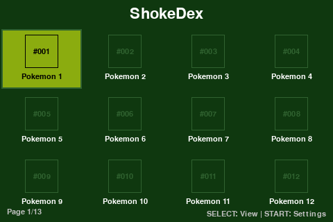
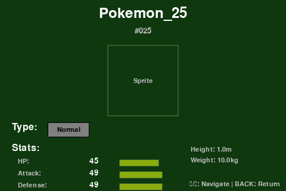
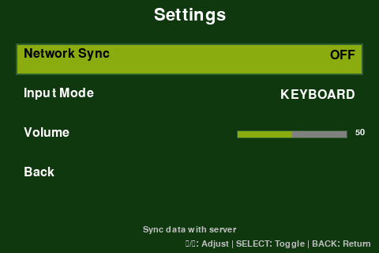

# ShokeDex UI Guide

This guide covers the UI system, screen architecture, and input handling in ShokeDex.

## Screenshots

### Home Screen


### Detail Screen


### Settings Screen


## Overview

The ShokeDex UI is built with Pygame and optimized for a 480x320 pixel LCD display. It features:

- **Retro Gameboy-inspired aesthetic** with a custom color palette
- **Screen stack navigation** for managing multiple views
- **Input abstraction** supporting both keyboard (dev) and GPIO buttons (hardware)
- **Multiple view types** including grid, list, and detail views

## Architecture

### Components

1. **InputManager** (`src/input_manager.py`)
   - Handles input from keyboard and GPIO buttons
   - Provides unified InputAction abstraction
   - Supports event handlers and mode switching

2. **ScreenManager** (`src/ui/screen_manager.py`)
   - Manages screen stack (push/pop/replace)
   - Handles screen transitions
   - Routes input and update/render calls

3. **Screen Classes** (`src/ui/`)
   - `Screen`: Abstract base class for all screens
   - `HomeScreen`: Grid view of Pokémon
   - `ListScreen`: List view of Pokémon
   - `DetailScreen`: Detailed Pokémon information
   - `SettingsScreen`: Application settings

4. **Main Application** (`src/main.py`)
   - Entry point and main game loop
   - Initializes Pygame and all systems
   - Manages FPS and timing

## Input System

### InputAction Enum

Available input actions:
- `UP`, `DOWN`, `LEFT`, `RIGHT`: Navigation
- `SELECT`: Confirm/Select
- `BACK`: Go back/Cancel
- `START`: Open menu
- `NONE`: No action

### Keyboard Mappings (Default)

| Action | Keys |
|--------|------|
| UP | ↑, W |
| DOWN | ↓, S |
| LEFT | ←, A |
| RIGHT | →, D |
| SELECT | Enter, Space |
| BACK | Escape, Backspace |
| START | Tab |

### GPIO Mappings (Default BCM Pins)

| Action | Pin |
|--------|-----|
| UP | 17 |
| DOWN | 27 |
| LEFT | 22 |
| RIGHT | 23 |
| SELECT | 24 |
| BACK | 25 |
| START | 16 |

### Custom Mappings

You can customize key/pin mappings:

```python
from src.input_manager import InputManager, InputAction
import pygame

custom_keyboard = {
    pygame.K_z: InputAction.SELECT,
    pygame.K_x: InputAction.BACK,
    # ... more mappings
}

input_manager = InputManager(
    mode=InputMode.KEYBOARD,
    keyboard_map=custom_keyboard
)
```

## Screen System

### Screen Lifecycle

Each screen follows this lifecycle:

1. **Construction**: `__init__()` - Initialize data structures
2. **Activation**: `on_enter()` - Called when screen becomes active
3. **Active**: Receives input, updates, and renders
4. **Deactivation**: `on_exit()` - Called when screen becomes inactive

### Creating a Custom Screen

```python
from src.ui.screen import Screen
from src.input_manager import InputAction

class MyScreen(Screen):
    def __init__(self, screen_manager):
        super().__init__(screen_manager)
        # Initialize your data
    
    def on_enter(self):
        """Called when screen becomes active"""
        super().on_enter()
        # Load resources, initialize fonts, etc.
    
    def handle_input(self, action: InputAction):
        """Handle user input"""
        if action == InputAction.BACK:
            self.screen_manager.pop()
    
    def update(self, delta_time: float):
        """Update screen state"""
        # Update animations, logic, etc.
    
    def render(self, surface: pygame.Surface):
        """Render the screen"""
        surface.fill((0, 0, 0))
        # Draw your UI
```

### Screen Navigation

```python
# Push a new screen (add to stack)
new_screen = DetailScreen(screen_manager, pokemon_id=25)
screen_manager.push(new_screen)

# Pop current screen (go back)
screen_manager.pop()

# Replace current screen (no history)
screen_manager.replace(new_screen)
```

## Screens

### HomeScreen

**Purpose**: Main screen showing a grid of Pokémon

**Features**:
- 4x3 grid layout (12 Pokémon per page)
- Pagination for navigating through all Pokémon
- Shows Pokémon ID and name
- Navigate with arrow keys

**Controls**:
- Arrow keys: Navigate grid
- SELECT: View Pokémon details
- START: Open settings

### ListScreen

**Purpose**: Alternative list view of Pokémon

**Features**:
- Shows 8 Pokémon per page
- Displays ID, name, and types
- Scrollbar indicator
- More compact than grid view

**Controls**:
- UP/DOWN: Navigate list
- SELECT: View Pokémon details
- BACK: Return to previous screen

### DetailScreen

**Purpose**: Show detailed information about a Pokémon

**Features**:
- Pokémon sprite (placeholder)
- Name and ID
- Type badges with color coding
- Base stats with visual bars
- Height and weight
- Navigate between Pokémon

**Controls**:
- LEFT/RIGHT: Navigate to adjacent Pokémon
- BACK: Return to previous screen

### SettingsScreen

**Purpose**: Configure application settings

**Features**:
- Network sync toggle (stub)
- Input mode selection (keyboard/GPIO)
- Volume slider (stub)
- Interactive menu

**Controls**:
- UP/DOWN: Navigate menu
- LEFT/RIGHT: Adjust values
- SELECT: Activate item
- BACK: Return to previous screen

## Color Scheme

The UI uses a retro Gameboy Color-inspired palette defined in `src/ui/colors.py`:

### Primary Colors
- **Background**: Dark Green `(15, 56, 15)`
- **Foreground**: Pale Green `(155, 188, 15)`
- **Text**: White `(255, 255, 255)`

### UI Elements
- **Selection**: Light Green background with black text
- **Borders**: Green `(48, 98, 48)`
- **Highlights**: Light Blue `(153, 219, 255)`

### Type Colors
Each Pokémon type has a distinct color (Fire: Red, Water: Blue, etc.)

## Display Configuration

The UI is optimized for **480x320 pixels** - the size of common small LCD displays used with Raspberry Pi.

Configuration in `src/main.py`:
```python
DISPLAY_WIDTH = 480
DISPLAY_HEIGHT = 320
FPS = 30
```

### Adapting to Different Resolutions

To use a different resolution, modify the constants in `src/main.py` and adjust layout values in individual screen classes (grid_cols, cell_width, etc.).

## Running the Application

### Main Application (with database)

```bash
# Ensure database is initialized and seeded
python src/data/manage_db.py init
python src/data/manage_db.py seed --gen 1-3

# Run the application
python src/main.py
```

### UI Demo (without database)

```bash
# Run with mock data (no database needed)
python examples/ui_demo.py
```

## Development Tips

### Testing UI Changes

1. Use the UI demo for quick iteration without database setup
2. Use mock data for testing edge cases
3. Test with different screen sizes by modifying DISPLAY_WIDTH/HEIGHT

### Adding New Screens

1. Create a new class inheriting from `Screen`
2. Implement required methods: `handle_input()`, `update()`, `render()`
3. Add to `src/ui/__init__.py` for easy importing
4. Test navigation to/from your screen

### Performance Considerations

- Minimize operations in `render()` - it runs every frame
- Cache fonts and surfaces where possible
- Use `update()` for logic that doesn't need 30fps updates
- Consider using dirty rect rendering for complex screens

## Font System

Currently using Pygame's built-in font (None = default system font):

```python
self.title_font = pygame.font.Font(None, 32)  # 32pt
self.text_font = pygame.font.Font(None, 24)   # 24pt
self.small_font = pygame.font.Font(None, 16)  # 16pt
```

### Adding Custom Fonts

To use a custom retro pixel font:

1. Add font file to `assets/fonts/`
2. Load with: `pygame.font.Font("assets/fonts/myfont.ttf", size)`
3. Update all screens to use the custom font

Recommended free pixel fonts:
- Press Start 2P
- Pixel Operator
- Minecraftia

## GPIO Setup for Hardware

When running on Raspberry Pi with physical buttons:

1. Connect buttons to GPIO pins (see GPIO Mappings table)
2. Use pull-up resistors (button connects to ground)
3. Set input mode to GPIO:

```python
from src.input_manager import InputMode

input_manager = InputManager(mode=InputMode.GPIO)
```

The system will automatically fall back to keyboard if GPIO initialization fails.

## Troubleshooting

### Display Issues

**Problem**: Window doesn't appear
- Check DISPLAY environment variable
- Ensure Pygame is installed: `pip install pygame`

**Problem**: Screen is too large/small
- Adjust DISPLAY_WIDTH and DISPLAY_HEIGHT in main.py

### Input Issues

**Problem**: Keyboard not responding
- Ensure window has focus
- Check input_manager mode is KEYBOARD

**Problem**: GPIO not working
- Install gpiozero: `pip install gpiozero`
- Run with sudo on Raspberry Pi
- Check pin wiring

### Performance Issues

**Problem**: Low FPS
- Reduce FPS constant if needed (default: 30)
- Profile render() methods for bottlenecks
- Use simpler graphics

## Future Enhancements

Planned improvements:
- [ ] Custom retro pixel font
- [ ] Sprite display from database
- [ ] Animations and transitions
- [ ] Sound effects
- [ ] Touch screen support
- [ ] Additional view modes
- [ ] Favorites/bookmarks system
- [ ] Search functionality

## API Reference

See inline documentation in source files:
- `src/input_manager.py` - Input handling
- `src/ui/screen.py` - Base screen class
- `src/ui/screen_manager.py` - Screen stack management
- Individual screen files for screen-specific APIs

## Contributing

When adding UI features:
1. Follow the existing screen pattern
2. Use the Colors class for consistency
3. Test on 480x320 resolution
4. Support both keyboard and GPIO input
5. Add documentation for new features
